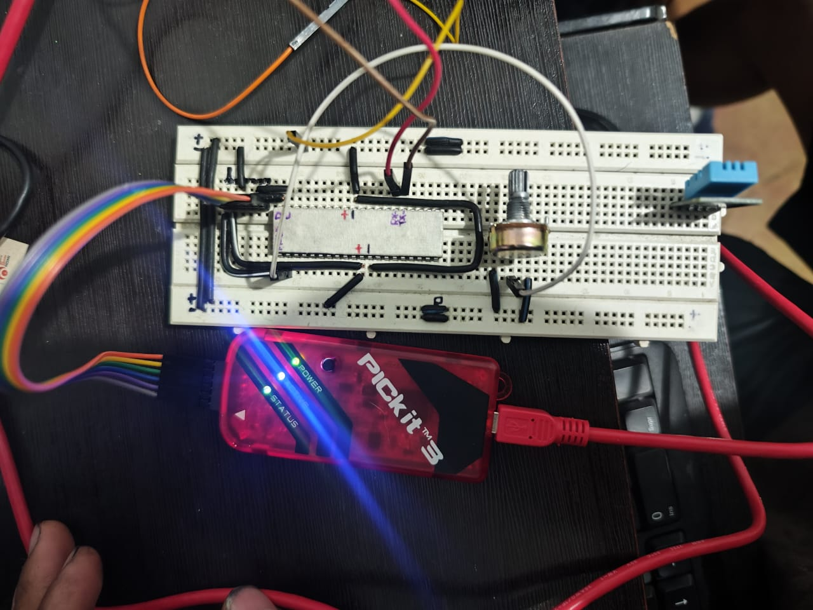
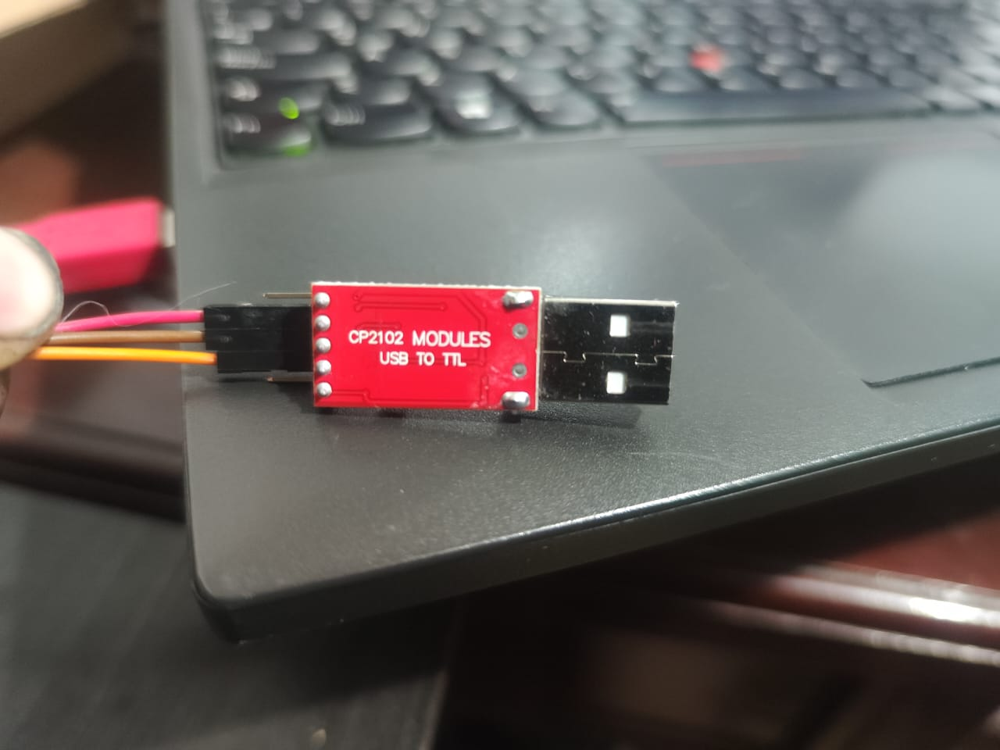
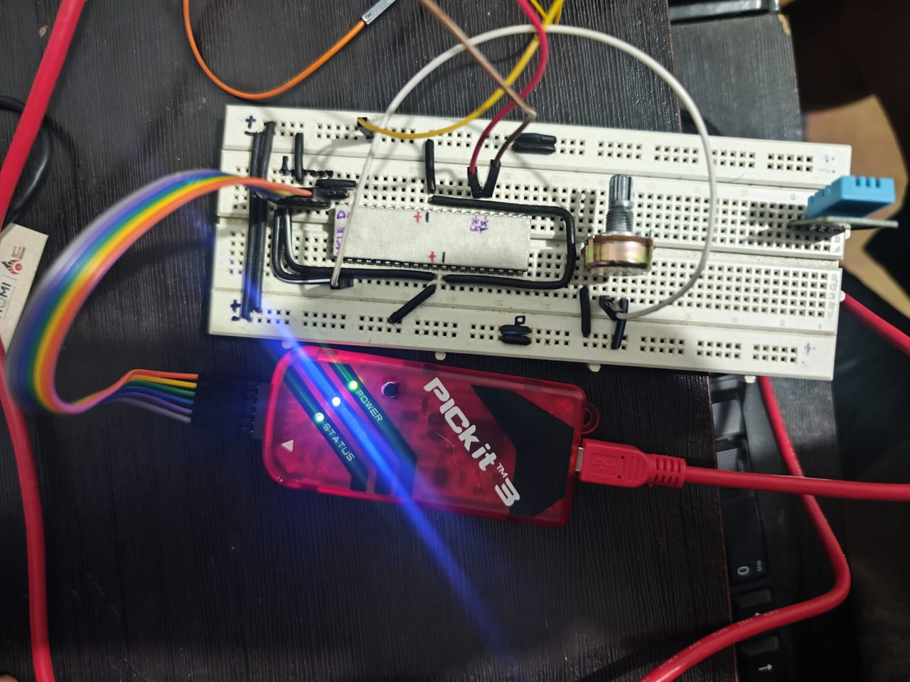
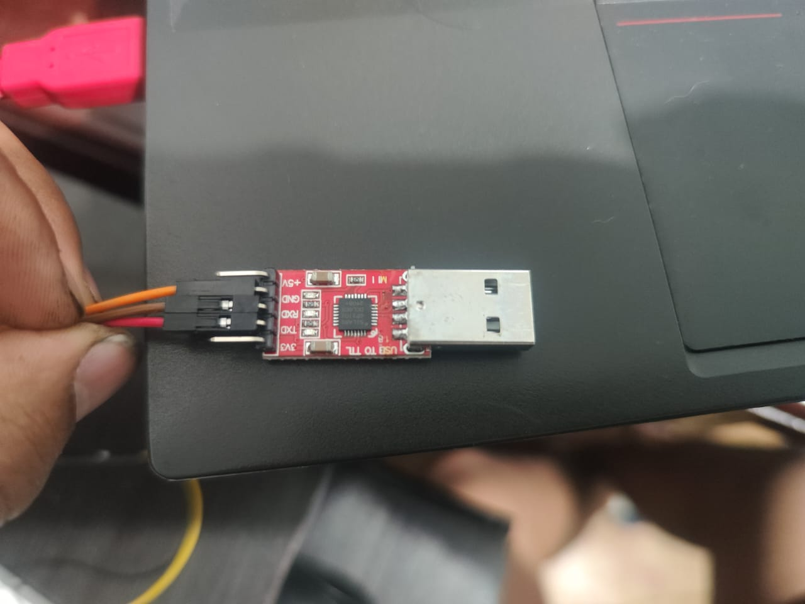
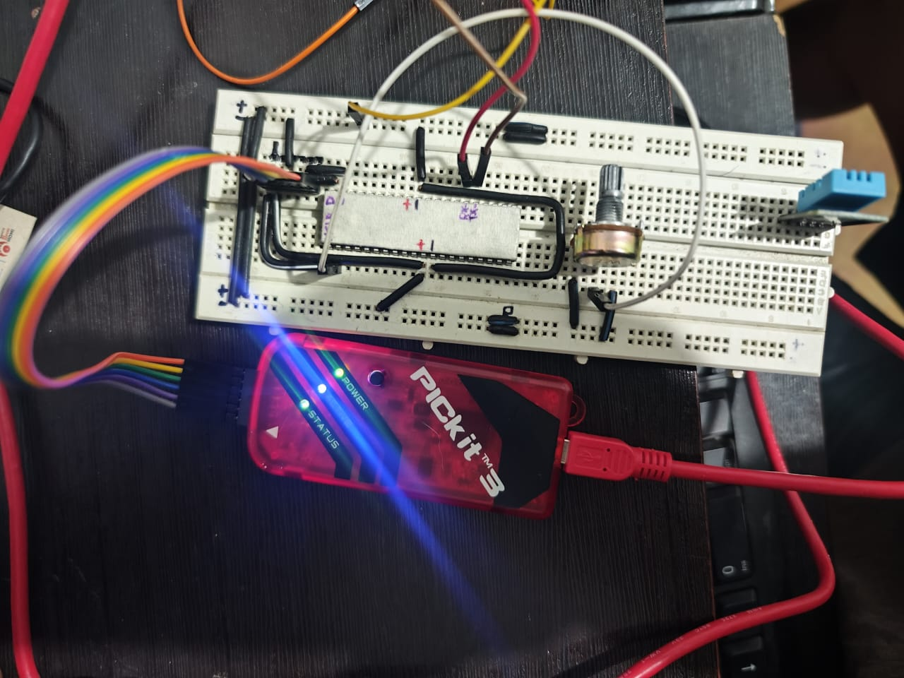
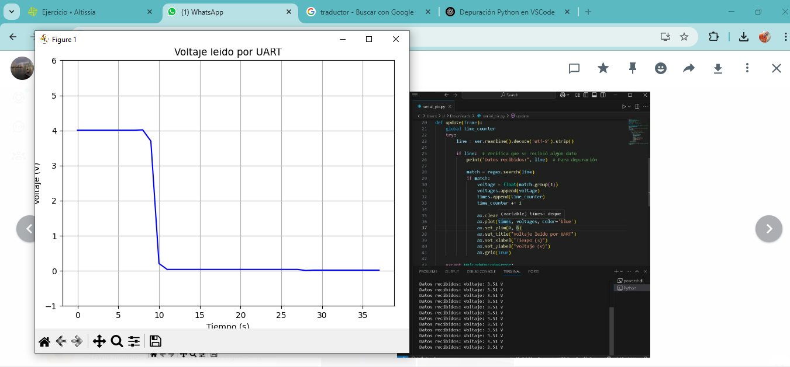
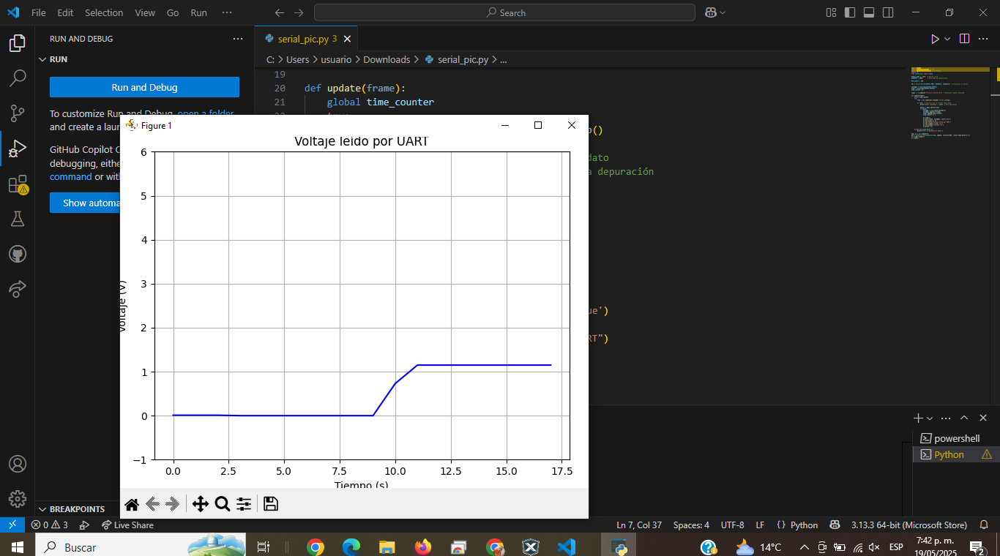
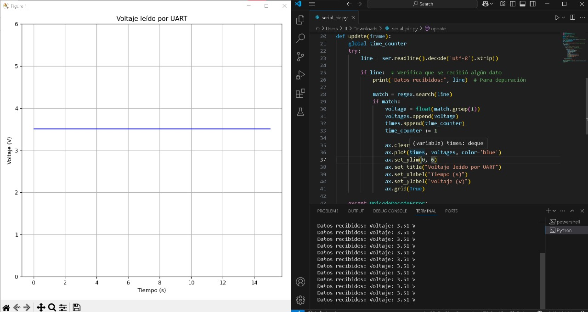

# Lab04: Comunicación UART en PIC18F45K22

### Integrantes
[Sebastian vela Ruiz](https://github.com/Sebasvela28)

[Sebastian Guzman Verano](https://github.com/JuanSebastianGuzmanVerano)

[Jeisson Steven Gomez Salcedo](https://github.com/Ja2000ck)

### Documentación
##  Objetivos y Alcances

En este laboratorio, el objetivo fue implementar la comunicación serial UART utilizando el microcontrolador PIC18F45K22. La meta principal era enviar datos desde el PIC hacia un computador por medio de un conversor USB-UART, usando una velocidad de 9600 baudios. Se buscaba también entender cómo funciona la transmisión asíncrona, además de practicar la configuración de registros y la programación básica del módulo UART.

## Fundamento Teórico

UART (Universal Asynchronous Receiver/Transmitter) es un protocolo de comunicación que permite enviar y recibir datos sin necesidad de una señal de reloj. Solo necesita dos cables: uno para transmitir (TX) y otro para recibir (RX). El PIC18F45K22 cuenta con un módulo llamado EUSART que se puede configurar como UART.

En este caso, se usó una velocidad de transmisión de 9600 baudios. Esto significa que se envían 9600 bits por segundo. Para lograr esto, se debe calcular un valor llamado SPBRG, que depende de la frecuencia del PIC. También es importante configurar bien los registros que activan el módulo UART y los pines correctos (RC6 como salida y RC7 como entrada).

## Implementación y Procedimiento

# Materiales Utilizados:

PIC18F45K22

Pickit 3 

MPLAB X IDE + XC8 Compiler

Conversor USB a serial 

Cables de conexión

Software de terminal serial PuTTY 

# Procedimiento:

Configuración Inicial: Se creó un nuevo proyecto en MPLAB X. Se configuraron los fuses del microcontrolador para usar el oscilador interno, apagar el Watchdog Timer y desactivar la programación en bajo voltaje.

Configuración de UART: En el archivo uart.c se escribió una función llamada UART_Init que configura:

RC6 como salida y RC7 como entrada

Velocidad de transmisión de 9600 baudios (SPBRG = 25 con oscilador de 16 MHz)

Activación del módulo UART y del transmisor

Funciones de Envío: También se implementaron funciones como UART_WriteChar para enviar un carácter, y UART_WriteString para enviar un mensaje completo letra por letra.

Función Principal (main.c): Se llamó a UART_Init() y luego se usó UART_WriteString() para enviar mensajes como "Hola mundo" al terminal serial conectado.

Verificación con Terminal: Se usó PuTTY en Windows o CuteCom en Linux para verificar que el mensaje llegara correctamente. Se seleccionó el puerto adecuado, velocidad de 9600, sin paridad y 1 bit de parada.

## Resultados y Observaciones

Durante las pruebas, el sistema fue capaz de enviar datos desde el PIC al computador de forma correcta. En el monitor serial se pudo ver el mensaje enviado. El uso del oscilador interno a 16 MHz funcionó correctamente para generar el baud rate deseado. La transmisión fue estable y sin errores aparentes.

También se observó que si el terminal no está bien configurado (por ejemplo, velocidad diferente), los datos se ven como caracteres extraños. Esto ayudó a entender la importancia de que ambos dispositivos usen los mismos parámetros de comunicación.

## Conclusión y Recomendaciones

La implementación del UART en el PIC18F45K22 permitió comprender mejor cómo se puede comunicar un microcontrolador con un computador. El laboratorio mostró la importancia de configurar correctamente los registros y verificar las conexiones físicas. Se recomienda en próximos proyectos implementar también la recepción de datos y usar interrupciones para una comunicación más eficiente.

## Referencias

[1] Mikroe. (n.d.). PIC Microcontrollers Programming in Assembly. Disponible en: https://www.mikroe.com/ebooks/pic-microcontrollers-programming-in-assembly

[2] Modulación UART. (n.d.). Documentación oficial Microchip.

[3] PuTTY: https://www.putty.org

### Implmentación

## Código del proyecto 

## montaje 

## graficas 

